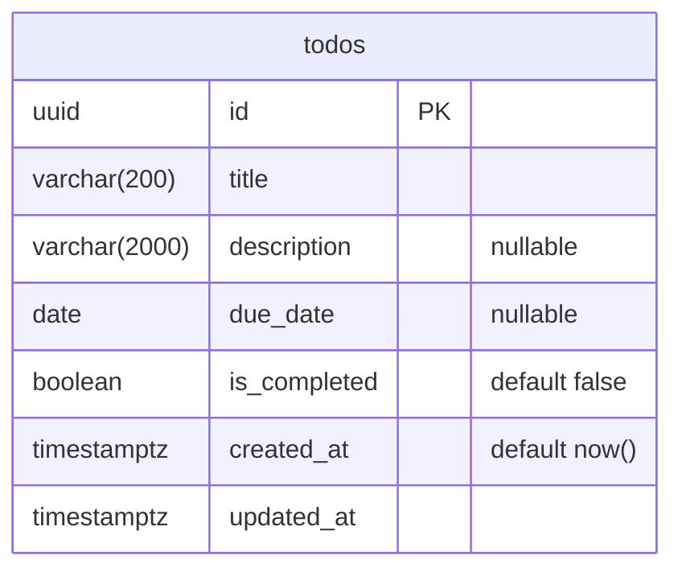

# Development guide

Everything you need to go from a fresh clone to green tests on macOS.

## 1. Prerequisites

| Tool       | Version | Install                                    |
| ---------- | ------- | ------------------------------------------ |
| Node.js    | 24+     | `brew install node` (or a version manager) |
| pnpm       | 11+     | `corepack enable` or `brew install pnpm`   |
| PostgreSQL | 18      | `brew install postgresql@18`               |

Check what you have:

```sh
node --version   # v24.x
pnpm --version   # 11.x
psql --version   # psql (PostgreSQL) 18.x
```

## 2. Start PostgreSQL

Homebrew's Postgres runs as your macOS user and, by default, trusts local
connections from that user — no password required.

```sh
brew services start postgresql@18   # start now and on login
pg_isready                          # expect: /tmp:5432 - accepting connections
```

If `psql` is not on your `PATH` after installing, add Homebrew's bin dir:

```sh
echo 'export PATH="/opt/homebrew/opt/postgresql@18/bin:$PATH"' >> ~/.zshrc
```

## 3. Create the databases

The project uses two databases so tests can never touch development data:

| Database    | Purpose                                              |
| ----------- | ---------------------------------------------------- |
| `foci_dev`  | Local development                                    |
| `foci_test` | Used exclusively by `pnpm test`; wiped between tests |

Create them once:

```sh
createdb foci_dev
createdb foci_test
```

Or run the idempotent helper, which does the same and is safe to re-run:

```sh
pnpm db:setup
```

Verify:

```sh
psql -d postgres -Atc "SELECT datname FROM pg_database WHERE datname LIKE 'foci_%'"
# foci_dev
# foci_test
```

## 4. Configure the environment

The API package reads its connection strings from `apps/api/.env`, which is
git-ignored. Copy the example and fill in your macOS username:

```sh
cp apps/api/.env.example apps/api/.env
sed -i '' "s/<macos-user>/$(whoami)/g" apps/api/.env
cat apps/api/.env
```

You should see two URLs of the form `postgresql://<you>@localhost:5432/foci_dev`
and `.../foci_test`.

## 5. Install and verify

```sh
pnpm install
pnpm typecheck   # generates the Prisma client, then tsc --noEmit
pnpm test        # generates the Prisma client, then vitest against foci_test
```

Both commands must be green before committing.

## Everyday commands

All commands run from the repository root.

| Command                                                       | What it does                                                  |
| ------------------------------------------------------------- | ------------------------------------------------------------- |
| `pnpm typecheck`                                              | Type-check every workspace package                            |
| `pnpm test`                                                   | Run every test suite                                          |
| `pnpm --filter @foci/api test -- src/db/connectivity.test.ts` | Run a single test file                                        |
| `pnpm --filter @foci/api exec vitest`                         | Run tests in watch mode                                       |
| `pnpm db:setup`                                               | Create `foci_dev` / `foci_test` if they don't exist           |
| `pnpm db:migrate`                                             | Apply pending migrations to `foci_dev` (`prisma migrate dev`) |

## Migrations

The schema lives in `apps/api/prisma/schema.prisma`; every change to it ships
as a SQL migration under `apps/api/prisma/migrations/`. Never edit the database
by hand.

| Task                                            | Command (from the repo root)                                                 |
| ----------------------------------------------- | ---------------------------------------------------------------------------- |
| Apply pending migrations to `foci_dev`          | `pnpm db:migrate`                                                            |
| Create a new migration after editing the schema | `pnpm --filter @foci/api exec prisma migrate dev --name <short_description>` |
| Apply migrations to `foci_test` manually        | `pnpm --filter @foci/api db:migrate:test` (tests do this automatically)      |
| Drop and recreate `foci_dev` from scratch       | `pnpm --filter @foci/api db:reset`                                           |
| Inspect the live table                          | `psql -d foci_dev -c '\d todos'`                                             |

`prisma migrate dev` both writes the migration file and applies it, then
regenerates the Prisma client. Commit the generated `migration.sql` alongside
the schema change.

## How tests reach the database

- `apps/api/src/test/setup.ts` runs before every test file and overwrites
  `DATABASE_URL` with `TEST_DATABASE_URL`, so Prisma always points at
  `foci_test` during tests regardless of what `.env` says for development.
- Test files run serially (`fileParallelism: false`) because they share one
  database.
- Tests use a real Postgres connection; nothing is mocked.

## Viewing the database

### From the terminal

```sh
psql -d foci_dev -c '\dt'                       # list tables
psql -d foci_dev -c '\d todos'                  # columns, types, defaults, indexes
psql -d foci_dev -c 'SELECT * FROM todos'       # rows
psql -d foci_dev -c 'SELECT * FROM _prisma_migrations'   # applied migrations
```

Or open an interactive session with `psql foci_dev` and use `\dt`, `\d todos`,
`\l` (all databases), `\c foci_test` (switch database), `\q` (quit).

### Prisma Studio (row browser, no install)

```sh
pnpm --filter @foci/api exec prisma studio     # opens http://localhost:5555
```

A spreadsheet-style view of each model where you can add, edit, and delete
rows. Good for inspecting data; it doesn't show structure.

### Desktop / editor GUIs

Any Postgres client works. Connection details for all of them:

| Field    | Value                          |
| -------- | ------------------------------ |
| Host     | `localhost`                    |
| Port     | `5432`                         |
| Database | `foci_dev` (or `foci_test`)    |
| User     | your macOS username (`whoami`) |
| Password | none                           |

- **TablePlus** — `brew install --cask tableplus`; lightweight and macOS-native.
- **Postico** — Postgres-only, similar feel.
- **DBeaver** / **pgAdmin** — heavier, free; DBeaver can draw ER diagrams.
- **VS Code** — the _PostgreSQL_ extension (`ms-ossdata.vscode-pgsql`) adds a
  schema explorer and query panel to the sidebar.

### Entity diagram

The schema is currently one table:



When a second table appears, consider `prisma-erd-generator` to regenerate
this automatically on every `prisma generate`.

## Troubleshooting

**`pg_isready` says "no response"** — the server isn't running. Start it with
`brew services start postgresql@18`, or check `brew services list`.

**`FATAL: role "<user>" does not exist`** — the `.env` username doesn't match
the Postgres superuser. Homebrew creates a role named after the macOS user that
installed it; run `whoami` and use that.

**`FATAL: database "foci_test" does not exist`** — step 3 was skipped. Run
`pnpm db:setup`.

**`TEST_DATABASE_URL is not set`** — `apps/api/.env` is missing. Do step 4.

**Prisma prints an upgrade banner about a newer major version** — harmless; the
project pins Prisma 7 deliberately.

**Tests fail with schema or migration errors on `foci_test`** — the test
database has drifted (e.g. a migration was edited after being applied). Reset
it and let the test run re-apply migrations:

```sh
dropdb foci_test && createdb foci_test && pnpm test
```

**Starting over** — drop both databases and repeat step 3:

```sh
dropdb foci_dev; dropdb foci_test; pnpm db:setup
```
