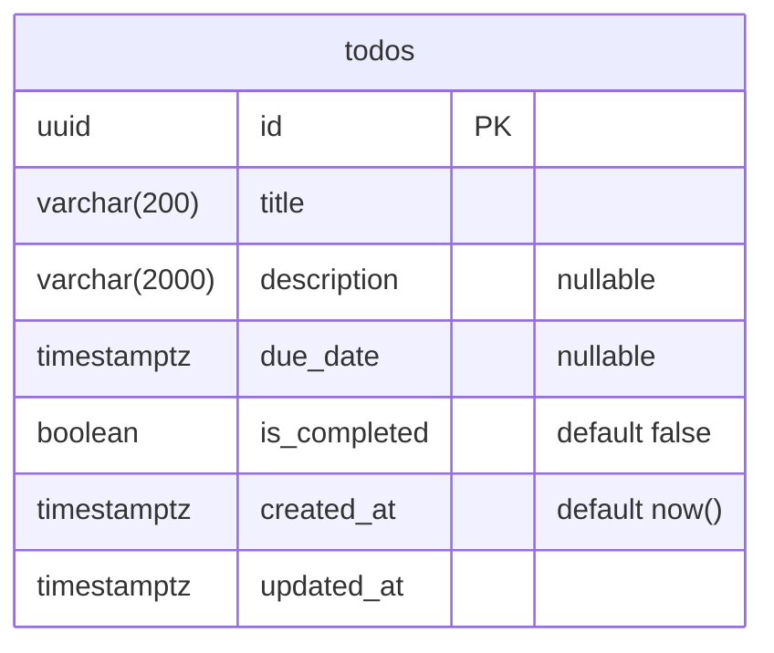

# Development guide

Everything you need to go from a fresh clone to green tests on macOS. The
project was built on a Mac and the steps below assume Homebrew; Windows users
should read [Windows setup](#windows-setup) first, then come back to step 5.

## 1. Prerequisites

| Tool       | Version | Install                                    |
| ---------- | ------- | ------------------------------------------ |
| Node.js    | 24+     | `brew install node` (or a version manager) |
| pnpm       | 11+     | `corepack enable` or `brew install pnpm`   |
| PostgreSQL | 18      | `brew install postgresql@18`               |

Check what you have:

```sh
node --version   # v24.x
pnpm --version   # 11.x
psql --version   # psql (PostgreSQL) 18.x
```

## 2. Start PostgreSQL

Homebrew's Postgres runs as your macOS user and, by default, trusts local
connections from that user — no password required.

```sh
brew services start postgresql@18   # start now and on login
pg_isready                          # expect: /tmp:5432 - accepting connections
```

If `psql` is not on your `PATH` after installing, add Homebrew's bin dir:

```sh
echo 'export PATH="/opt/homebrew/opt/postgresql@18/bin:$PATH"' >> ~/.zshrc
```

## 3. Create the databases

The project uses two databases so tests can never touch development data:

| Database    | Purpose                                              |
| ----------- | ---------------------------------------------------- |
| `foci_dev`  | Local development                                    |
| `foci_test` | Used exclusively by `pnpm test`; wiped between tests |

Create them once:

```sh
createdb foci_dev
createdb foci_test
```

Or run the idempotent helper, which does the same and is safe to re-run:

```sh
pnpm db:setup
```

Verify:

```sh
psql -d postgres -Atc "SELECT datname FROM pg_database WHERE datname LIKE 'foci_%'"
# foci_dev
# foci_test
```

## 4. Configure the environment

The API package reads its connection strings from `apps/api/.env`, which is
git-ignored. Copy the example and fill in your macOS username:

```sh
cp apps/api/.env.example apps/api/.env
sed -i '' "s/<macos-user>/$(whoami)/g" apps/api/.env
cat apps/api/.env
```

You should see two URLs of the form `postgresql://<you>@localhost:5432/foci_dev`
and `.../foci_test`.

## 5. Install and verify

```sh
pnpm install
pnpm db:migrate  # apply migrations to foci_dev (tests migrate foci_test themselves)
pnpm typecheck   # generates the Prisma client, then tsc --noEmit
pnpm test        # generates the Prisma client, then vitest against foci_test
```

`typecheck` and `test` must be green before committing. Confirm the table
landed in your dev database with `psql -d foci_dev -c '\d todos'`.

## 6. Run the app

```sh
pnpm dev                                   # API on http://127.0.0.1:3000 + web on http://localhost:5173
curl -s -X POST localhost:3000/todos -H 'content-type: application/json' \
  -d '{"title":"Buy milk","dueDate":"2026-09-01T17:00:00Z"}'
curl -s localhost:3000/todos/<id-from-above>
open http://localhost:5173                 # the todo list
```

`pnpm dev` starts both packages in parallel. The API port comes from `PORT` in
`apps/api/.env` (default `3000`); it binds to `127.0.0.1` only, shuts down
cleanly on Ctrl-C, and logs requests as JSON lines. The web app is served by
Vite on `localhost:5173`; the browser calls relative `/api/*` URLs and Vite's
dev proxy forwards them to the API with the `/api` prefix stripped, so there is
no CORS configuration and no `VITE_*` environment variable. The full endpoint
list is in the [README](./README.md#endpoints).

## Windows setup

The project was developed and tested only on macOS. The steps below have not
been verified on a Windows machine; if something fails that isn't covered
here, please open an issue. Two of the repo's scripts are POSIX shell scripts,
so on Windows you have two options:

- **WSL 2 (recommended).** Install Ubuntu from the Microsoft Store, install
  Node, pnpm, and PostgreSQL inside it (`sudo apt install postgresql-18`, or
  the [PGDG apt repo](https://www.postgresql.org/download/linux/ubuntu/)), and
  follow the macOS guide from step 3 with `sudo service postgresql start` in
  place of `brew services`. Ubuntu's Postgres does not trust your OS user, so
  either create a role for it (`sudo -u postgres createuser -s $(whoami)`) or
  put a password in the URLs as described below. Use the WSL filesystem
  (`~/`), not `/mnt/c/`, for a fast `pnpm install`.
- **Native Windows (PowerShell).** Follow the rest of this section.

### 1. Prerequisites

| Tool       | Version | Install                                                        |
| ---------- | ------- | -------------------------------------------------------------- |
| Node.js    | 24+     | `winget install OpenJS.NodeJS` or [nodejs.org](https://nodejs.org) |
| pnpm       | 11+     | `corepack enable` (run PowerShell as Administrator once)       |
| PostgreSQL | 18      | `winget install PostgreSQL.PostgreSQL.18` or the [EDB installer](https://www.postgresql.org/download/windows/) |

The installer asks for a password for the `postgres` superuser — remember it,
you need it in step 3. It also registers a Windows service that starts
automatically. Add `C:\Program Files\PostgreSQL\18\bin` to your `PATH` so
`psql` and `createdb` work from PowerShell, then check:

```powershell
node --version   # v24.x
pnpm --version   # 11.x
psql --version   # psql (PostgreSQL) 18.x
```

### 2. Create the databases

`pnpm db:setup` is a shell script and does not run in PowerShell. Create the
databases directly (enter the `postgres` password when prompted):

```powershell
createdb -U postgres foci_dev
createdb -U postgres foci_test
```

To avoid the password prompt on every `psql`/`createdb` call, set
`$env:PGPASSWORD = "<password>"` for the session or create a
`%APPDATA%\postgresql\pgpass.conf` file containing
`localhost:5432:*:postgres:<password>`.

### 3. Configure the environment

Copy the example and put the `postgres` user and password in both URLs
(Windows Postgres requires password auth; there is no OS-user trust):

```powershell
Copy-Item apps\api\.env.example apps\api\.env
```

Then edit `apps\api\.env` so it reads:

```
DATABASE_URL="postgresql://postgres:<password>@localhost:5432/foci_dev"
TEST_DATABASE_URL="postgresql://postgres:<password>@localhost:5432/foci_test"
PORT=3000
```

If the password contains characters like `@`, `:`, or `#`, percent-encode
them (`@` → `%40`).

### 4. Install and verify

Same as the macOS guide from step 5:

```powershell
pnpm install
pnpm db:migrate
pnpm typecheck
pnpm test
pnpm dev
```

### Windows caveats

- `pnpm db:setup` and `pnpm --filter @foci/api db:migrate:test` are POSIX
  shell commands; use the manual `createdb` commands above. The test suite
  migrates `foci_test` itself, so the second script is rarely needed.
- `curl` in PowerShell is an alias for `Invoke-WebRequest`; use `curl.exe`
  or `Invoke-RestMethod` for the examples in step 6.
- Git may convert line endings; if a shell script complains about `\r`, run
  `git config core.autocrlf false` and re-clone, or use WSL.
- If port 5432 is already in use by another Postgres install, change the port
  in both `.env` URLs.

## Everyday commands

All commands run from the repository root.

| Command                                                       | What it does                                                  |
| ------------------------------------------------------------- | ------------------------------------------------------------- |
| `pnpm dev`                                                    | Start the API (`tsx watch`) and the web app (Vite) together  |
| `pnpm typecheck`                                              | Type-check every workspace package                            |
| `pnpm test`                                                   | Run every test suite                                          |
| `pnpm --filter @foci/api test:coverage`                       | Tests plus a coverage report for the API modules              |
| `pnpm --filter @foci/web test:coverage`                       | Tests plus a coverage report for the web app                  |
| `pnpm --filter @foci/web build`                               | Type-check and bundle the web app to `apps/web/dist` (nothing serves it yet) |
| `pnpm --filter @foci/api test -- src/db/connectivity.test.ts` | Run a single test file                                        |
| `pnpm --filter @foci/api exec vitest`                         | Run tests in watch mode                                       |
| `pnpm db:setup`                                               | Create `foci_dev` / `foci_test` if they don't exist           |
| `pnpm db:migrate`                                             | Apply pending migrations to `foci_dev` (`prisma migrate dev`) |

## Migrations

The schema lives in `apps/api/prisma/schema.prisma`; every change to it ships
as a SQL migration under `apps/api/prisma/migrations/`. Never edit the database
by hand.

| Task                                            | Command (from the repo root)                                                 |
| ----------------------------------------------- | ---------------------------------------------------------------------------- |
| Apply pending migrations to `foci_dev`          | `pnpm db:migrate`                                                            |
| Create a new migration after editing the schema | `pnpm --filter @foci/api exec prisma migrate dev --name <short_description>` |
| Apply migrations to `foci_test` manually        | `pnpm --filter @foci/api db:migrate:test` (tests do this automatically)      |
| Drop and recreate `foci_dev` from scratch       | `pnpm --filter @foci/api db:reset`                                           |
| Inspect the live table                          | `psql -d foci_dev -c '\d todos'`                                             |

`prisma migrate dev` both writes the migration file and applies it, then
regenerates the Prisma client. Commit the generated `migration.sql` alongside
the schema change.

## How tests reach the database

- `apps/api/src/test/setup.ts` runs before every test file and overwrites
  `DATABASE_URL` with `TEST_DATABASE_URL`, so Prisma always points at
  `foci_test` during tests regardless of what `.env` says for development.
- Test files run serially (`fileParallelism: false`) because they share one
  database.
- Tests use a real Postgres connection; nothing is mocked.
- API tests call the Fastify app in-process through `app.inject()` (wrapped by
  `apps/api/src/test/http.ts`), so no port is opened and the same database
  lifecycle applies.
- Web tests (`apps/web`) never touch the database or a port: they render the
  whole app under jsdom with React Testing Library and answer its `fetch`
  calls with [MSW](https://mswjs.io) handlers declared per test
  (`apps/web/src/test/`). Handlers are typed against `@foci/contracts`, so the
  fake API can only return what the real one would. `TZ` is pinned in
  `vite.config.ts` so due-date formatting is deterministic.

## Viewing the database

### From the terminal

```sh
psql -d foci_dev -c '\dt'                       # list tables
psql -d foci_dev -c '\d todos'                  # columns, types, defaults, indexes
psql -d foci_dev -c 'SELECT * FROM todos'       # rows
psql -d foci_dev -c 'SELECT * FROM _prisma_migrations'   # applied migrations
```

Or open an interactive session with `psql foci_dev` and use `\dt`, `\d todos`,
`\l` (all databases), `\c foci_test` (switch database), `\q` (quit).

### Prisma Studio (row browser, no install)

```sh
pnpm --filter @foci/api exec prisma studio     # opens http://localhost:5555
```

A spreadsheet-style view of each model where you can add, edit, and delete
rows. Good for inspecting data; it doesn't show structure.

### Desktop / editor GUIs

Any Postgres client works. Connection details for all of them:

| Field    | Value                          |
| -------- | ------------------------------ |
| Host     | `localhost`                    |
| Port     | `5432`                         |
| Database | `foci_dev` (or `foci_test`)    |
| User     | your macOS username (`whoami`) |
| Password | none                           |

- **TablePlus** — `brew install --cask tableplus`; lightweight and macOS-native.
- **Postico** — Postgres-only, similar feel.
- **DBeaver** / **pgAdmin** — heavier, free; DBeaver can draw ER diagrams.
- **VS Code** — the _PostgreSQL_ extension (`ms-ossdata.vscode-pgsql`) adds a
  schema explorer and query panel to the sidebar.

### Entity diagram

The schema is currently one table:



When a second table appears, consider `prisma-erd-generator` to regenerate
this automatically on every `prisma generate`.

## Troubleshooting

**`pg_isready` says "no response"** — the server isn't running. Start it with
`brew services start postgresql@18`, or check `brew services list`.

**`FATAL: role "<user>" does not exist`** — the `.env` username doesn't match
the Postgres superuser. Homebrew creates a role named after the macOS user that
installed it; run `whoami` and use that.

**`FATAL: password authentication failed`** or a prompt for a password — your
Postgres isn't the Homebrew build with local trust auth (Postgres.app and most
Linux installs require a password). Put the credentials in the URL:
`postgresql://<user>:<password>@localhost:5432/foci_dev`.

**`relation "todos" does not exist` in `foci_dev`** — migrations haven't been
applied to the dev database. Run `pnpm db:migrate`. (`foci_test` is migrated
automatically by the test suite.)

**`FATAL: database "foci_test" does not exist`** — step 3 was skipped. Run
`pnpm db:setup`.

**`TEST_DATABASE_URL is not set`** — `apps/api/.env` is missing. Do step 4.

**Prisma prints an upgrade banner about a newer major version** — harmless; the
project pins Prisma 7 deliberately.

**Tests fail with schema or migration errors on `foci_test`** — the test
database has drifted (e.g. a migration was edited after being applied). Reset
it and let the test run re-apply migrations:

```sh
dropdb foci_test && createdb foci_test && pnpm test
```

**Starting over** — drop both databases and repeat step 3:

```sh
dropdb foci_dev; dropdb foci_test; pnpm db:setup
```
